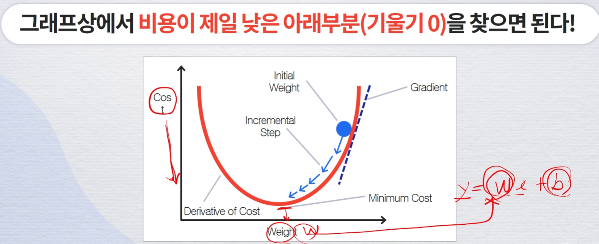
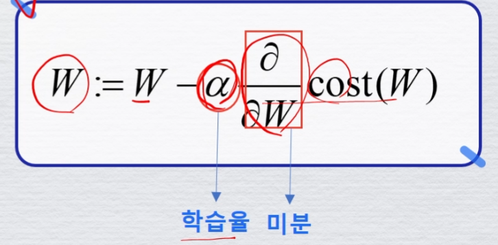

# 머신러닝 기본 개념
## 머신러닝 프로세스
데이터 수집 → 데이터 정리(테스트데이터셋) → 모델 학습 → 모델테스트(성능이 좋지 않다면 다시 모델 학습) → 모델 배포

## 머신러닝 기본 개념
과거: 데이터, 모델, prediction  
사람이 직접 데이터 패턴을 찾아 알고리즘 코딩하여 결과

→ 자동화 →

AI/머신러닝: 데이터, 모델, Prediction  
데이터와 결과를 기반으로 스스로 패턴 학습하고 이를 이용해서 예측  
지금은 모델을 만들고 데이터와 결과만 주면 됨.

## Linear Regrssion
직선 회귀(다시 돌아봄), 직선으 그어서 예측하는 모델

가설: 공부를 많이 하면 공부를 잘할 것이다.  
scatter 그래프 상 우상향 보임

점들을 잘 표현하는 한 직선을 구하는게 목표  
→ 그 의미는 가중치와 절편을 구한다는 의미

y = wx + b, w 가중치, b 절편, x 시간, y 점수 → 모델

컴퓨터는 어떤 가중치가 최적인지 어떻게 알 수 있는가  
> cost Function 이용!(작은 Cost로 결정)

Cost Function = (실제값 - 에측값)^2 / N  
→ MSE(Mean Squared Error)

## Gradient Descent Algorithm
Cost Function 최적화

제곱함수는 포물선 그림이 그려짐

그래프상 비용이 제일 낮은 아래부분(기울기 0) 을 찾으면 된다.




## 모델학습이란
목표: 최적의 직선 구하기→  
직선별 손실함수 구하기→  
손실함수 최소값 구하기→  
Gradient Descent Algorithm

# 머신러닝 기술 원리(종류, 성능평가 등)
## 데이터 확보
잘 정리된 데이터 확보가 중요

## 지도학습 vs 비지도학습
레이블(정답)이 있으냐 없는가가 가장 큰 차이

### 지도학습
분류모델, 예측모델
분류모델: 레이블의 값들이 이산적으로 나누어질 수 있는 문제
예측모델: 연속적인 값

데이터셋 구조
각 열을 특징/속성(featre) + 각 행을 예제 데이터라고 함

컬럼 중 하나를 선택해서 레이블(정답)으로 사용

#### 데이터 셋 분리
Train / Test or  
Train or  Validation or Test

#### 모델 선택
좋은 모델이란, 데이터의 패턴을 정확하게 따라가는 모델

과적합(Overfitting): 숨어있는 데이터에 대해서 못 맞추는 문제 발생  
 - 학습데이터만으로 했기 때문에 숨어있는건 못 맞춤

과소적합(Underfitting): 학습 많이 해야함

모델성능평가: Training과 Test가 비슷하게 가야함

#### 성능지표
학습이 끝난 후 모델을 성능평가하는 용도
- 회귀모델: MSE, MAE, R2
- 분류모델: 정확도, 정밀도, 재현율, F1-점수

회귀 성능지표  
1. MSE(Mean Squared Error): 예측값에 대한 실제값의 오차를 구하고 그 제곱값의 평균을 구하는 방식

2. MAE(Mean Absoulte Error): 예측값에 대한 실제값의 오차를 구하고 그 절댓값의 평균을 구하는 방식

3. R2, 결정계수: 회귀 모델에서 독립변수가 종속변수를 얼마나 잘 설명해주는지  
1에 가까울 수록 좋은 모델

분류모델 성능지표: Confusion Matrix(오차행렬)을 기반으로 수치 표현  
T(맞느냐 틀렸느냐)N(예측한값) → TN, FP, FN, TP

1. 정확도 = TP + Tn / TP + FN + FP + TN  
정확도의 함정 존재

2. 정밀도 = TP / TP + FP  
모델이 True라고 분류한 것 중에서 실제 True인 분류

3. 재현율: TP / TP + FN  
실제 True인 것중에서 모델이 True라고 예측한 것

4. F1점수(F1-score): 정밀도와 재현율의 조화평균  
= 2 * 1/(1/Precision + 1/Recall)

# 머신러닝 주요 알고리즘
## Scikit-learn
가장 인기 있는 머신러닝 패키지, 많은 머신러닝 알고리즘이 내장되어 있음

```python
from sklearn.family import Model
from sklearn.linear_model import LinearRegression
model = LinearRegression()
```

## 주요 알고리즘 분류
회귀: Linear Regression  
분류: Logistic Regrssion  
회귀+분류: Desicion Tree, Random FOrest, K-Nearest Neighbor

## Linear Regression
```python
from sklearn.linear_model import LinearRegression
model = LinearRegression()
model.fit(X_train, y_train)
pred = model.predict(X_Test)
```


