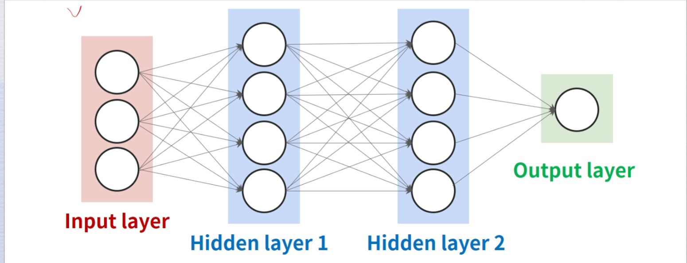
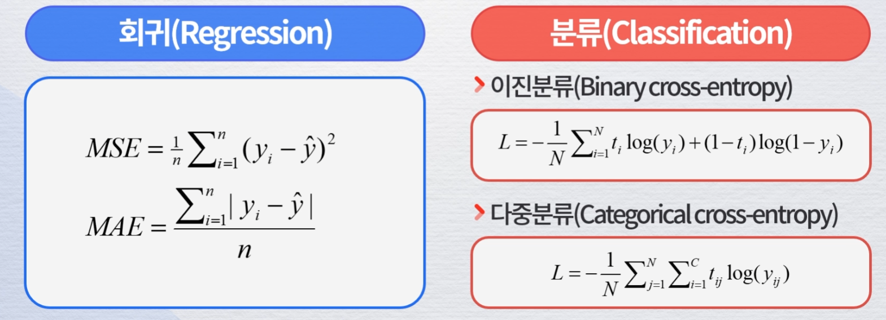
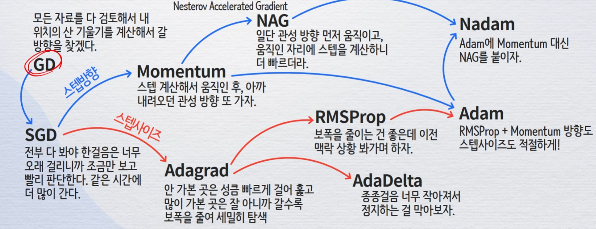
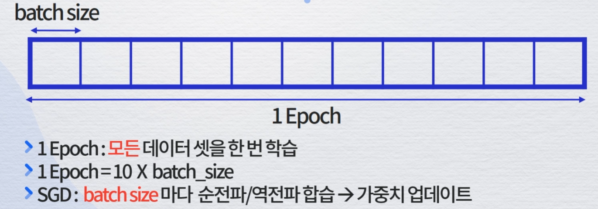

# 딥러닝 모델링
## 딥러닝 기본 개념
### 강아지와 고양이를 인식해서 분류
데이터의 특징 파악하여 패턴을 학습하여 분류/인식하는 것

### 딥러닝 목표
모델에 입력값을 넣었을 때 출력값이 최대한 정답과 일치하게 하는 것

### 딥러닝 학습방법
딥러닝 모델의 매개변수를 무작위로 부여한 후,  
반복학습을 통해 모델의 출력값을 정답과 일치하도록  
매개변수를 조금씩 조정함  
→ Gradient Descent 최적화 알고리즘(Cost 최소화)

## 딥러닝 기술 원리
### Perceptron
사람 두뇌에 있는 뉴런을 모델링한 것 → 간단한 함수를 학습할 수 있음

뉴런과 비슷한 컨셉

### DNN(Deep Neural network)
입력층과 출력층 사이에 여러 개의 은닉층으로 이루어진 인공신경망

신경망 출력에 비선형 활성화 함수를 추가하여 복잡한 비선형 관계를 모델링 할 수 있음


각 동그라미가 퍼셉트론(노드)이라고 보면됨

### Activation function
출력하기 위한 함수


### Loss Function


### Gradient Descent
DNN 모델의 가중치 파라미터들을 최적화 하는 방법

손실함수의 현 가중치에서 기울기를 구해서 Loss를 최소화하는 것

### Back Propagation
실제값과 모델 결과값에서 오차를 구해서 오차를 output에서 input방향을 보냄  
→ 가중치를 재업데이트하면서 학습


정답과 모델 결과값에서 오차를 구한 후, 만들어진 가중치를 다시 입력값을 보내면서 수정하는 과정

### Optimization Algorithm

Gradient Descent가 대표적


SGD

Adam 알고리즘 사용하면 됨

## 딥러닝 주요 알고리즘
### DNN(Dep Neural network): 심층신경망

#### Dropout
과적합(Overfitting) 방지용, Train 학습 시에만 적용

#### 구현
라이브러리 임포트
```py
import tensorflow as tf
from tensorflow.keras.models import Sequential
from tensorfrlow.keras.layers import Dense, Dropout
```

모델 생성 및 트레이닝
```py
model = Sequential()
model.add(Dense(4, input_shape=(3,), activation = 'relu'))
# Dense -> Hidden Layer 의미
model.add(Dropout(0.2))
model.add(Dense(4, activation='relu'))
# 두번째 hidden
model.add(Dense(1, activation='sigmoid'))
# 출력값, sigmoide 0 또는 1로 

model.compile(loss='binary_crossentorpy', optimizer='adam', metircs=['accuracy'])
history = model.fit(X_train, y_train, validation_Data = (X_test, Y_test), epochs = 40, batch_szie =10)
```