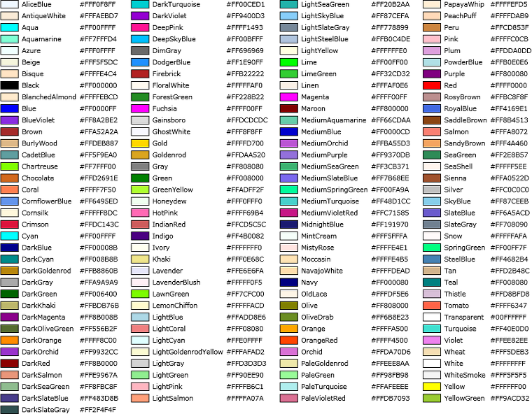
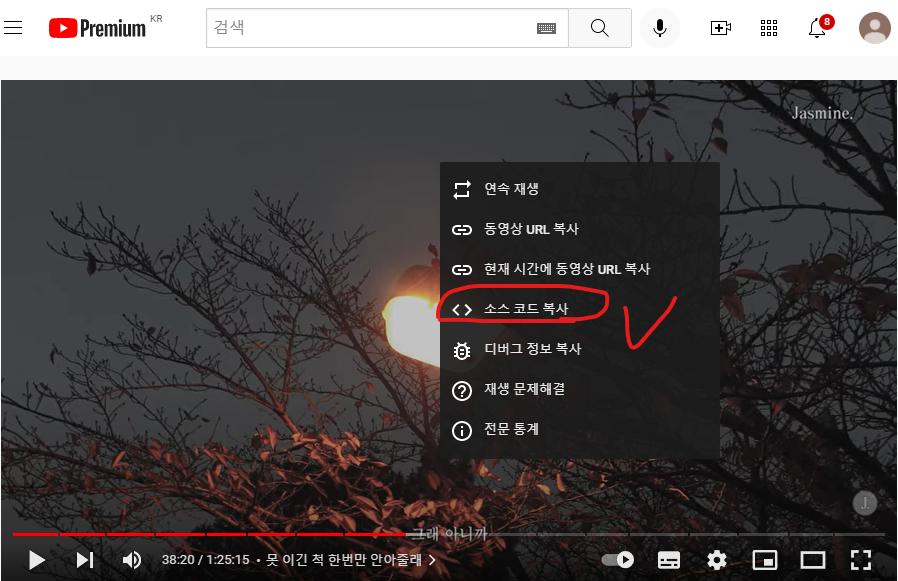

마크다운(Markdown)이란
 - 웹상에서 글을 쓰는 모든 사람들 위한 글쓰기 도구(서식, 포맷, 양식)
 - HTML 형식으로 변환시켜주는 간소한 서식이다.
 - 간소한 서식이기에 모든 HTML을 지원하지는 않는다
 - 표준이 없기 떄문에 표현하는 도구/플랫폼에서 서로 다르게 시현될 수 있다.
---
---
> github에서는 font size, font 색, font 배경색이 불가함(HTML 문법들은 안 먹히는 듯) 

마크다운 문법 목차

<span style = "font-size: 200%">[1. 구분선](#구분선)</span><br>
<span style = "font-size: 200%">[2. 줄바꿈](#줄바꿈)</span><br>
<span style = "font-size: 200%">[3. 제목](#제목타이틀---크기지정)</span><br>
<span style = "font-size: 200%">[4. 인용](#인용-구문)</span><br>
<span style = "font-size: 200%">[5. 폰트](#폰트)</span><br>

# 구분선
구분선은 "---" or "***"을 이용해서 만들 수 있다.

# 줄바꿈
한 문단 내 줄바꿈을 위해서는 **스페이스바**를 두 번 누르고 엔터를 입력하거나  
```
<br> → 문법을 사용하면 문단 내 줄바꿈
```

# 제목(타이틀) - 크기지정
"#"을 이용해서 1단게부터 6단계 까지 지정가능
```
HTML의 <h1> ~ <h6> 태그와 동일한 문법이다.
```
# 제목1
## 제목2
### 제목3
#### 제목4
##### 제목5
###### 제목6
github의 경우 제목1과 제목2에는 자동으로 줄이 생성된다.

# 인용 구문
```
HTML의 <blockquote> 문법이며
```
마크다운에서는 ">" 기호로 나타낸다.  
중첩이 가능하며 인용문 안에서도 마크다운 문법 사용 가능
> ## 제일 바깥 인용
>> 인용의 인용
>>> 인용의 인용의 인용
>> 인용의 인용
```
>
>>
>
Github의 경우 위와 같이 작성된 경우,
2번째 깊이까지 내려갔으므로 같은 문단에서는 다시 깊이가 낮아지지 않는다.
(3번째 줄 인용문구가 생략되고 2번째줄에 인용 깊이와 같아진다.)
```

# 폰트 스타일 지정
|스타일|구문|바로 가기 키|예시|출력|
|-|-|-|-|-|
|Bold|`** **` 또는 `__ __`|Ctrl + B|`**굵게 표시된 텍스트**`|**굵게 표시된 텍스트**|
|기울이기|`* *` 또는 `_ _`|Ctrl + I|`_기울임꼴 텍스트_`|_기울임꼴 텍스트_|
|취소선|`~~ ~~`|None|`~~취소선~~`|~~취소선~~|
|Bold+기울이기|`*** ***` 또는 `___ ___`| - |`***굉장히 중요***`|***굉장히 중요***|
|아래 첨자|`<sub> </sub>`|None|`<sub>아래에 써짐</sub> 이렇게`|<sub>아래에 써짐</sub> 이렇게|
|위 첨자|`<sup> </sup>`|None|`<sup>위에 써짐</sup> 이렇게`|<sup>위에 써짐</sup> 이렇게|


## 폰트 관련 HTML 코드
```
Bold 관련 HTML 및 CSS 문법
  - <b> b 태그 </b>
  - <strong> strong 태그 </strong>
  - front-weight 속성(css)
```
## 폰트 기울이기
```
기울이기 관련 HTML
 - <i> </i>
```

## 글자 색깔
```
<span style ="color:red"> 입력문자 </span>
<span style ="color:blue"> 입력문자 </span>
```
<span style = "color:yellow"> 노란색 글씨 </span>



## 형광펜
```
<span style ="background-color:red"> 입력문자 </span>
<span style ="background-color:blue"> 입력문자 </span>
...
```
<span style = "background-color:red"> 빨강색 배경 </span><br>

## 글자 크기 조정
```
<span style ="font-size:250%"> 입력문자 </span>
<span style ="font-size:100%"> 입력문자 </span>
기본 글자에서 크기로 퍼센트로 글자 크기 조절
```
<span style ="font-size:200%"> 글자크기 기본 사이즈의 200% </span>

## HTML 태그를 이용한 폰트 수정 한번에 하기
```
<b><span style = "color:white; background-color:red; font-size:150%"> 글자는 흰색, 배경은 빨강, 사이즈는 150% </span></b>
```
<b><span style = "color:white; background-color:red; font-size:150%"> 글자는 흰색, 배경은 빨강, 사이즈는 150% 굵기는 b태그로 설정</span>></b>

# 목차
목차는 `[보여지는 부분](#링크 부분)`를 이용한  
TOC(Talbe Of Content)로 태그를 이용하여 만들 수 있다.  
예시: `[3. 제목](#제목타이틀---크기지정)`

> 이때, 링크부분은 실제 "제목"과 동일하게 작성해야하며  
> 띄어쓰기는 "-"로 연결해야한다.  
> 또한, 제목1~제목5 동일하게 "#" 문구로 접근가능하다.

# 문자 박스(notice)
입력하는 문자를 강조하기 위해 박스에 넣는 문법
|Notice type|Class|
|:-:|:-|
|Dafult|.notice|
|Primary|.notice--primary|
|info|.notice--info|
|warning|.notice--warning|
|success|.notice-success|
|Danger|.notice-danger|

# 표(table)
파이프(|)를 이용해서 컬럼 만들기
기본 형태: 제목 한줄 + "-"를 이용한 표(table) 입력임을 표시
"-"개수는 의미 없다.
```
|제목1|제목2|제목3
|-|-|-|
|내용|내용|내용|
|내용|내용|내용|
```
> ---   정렬하지 않음  
> :---  왼쪽으로 정렬  
> ---:  오른쪽 정렬  
> :---: 가운대 정렬

|이름|나이|횟수|
|-|:-|-:|
|강아지|50|5
|고양이|30|4

# 인용코드
인용코드는 게시글 내 코드를 그대로 보여주기 위한 문법으로  
백틱(`)을 이용해서 입력할 수 있다.
```
고유한 블록 안으로 코드/텍스트 서식을 지정하려면 삼중 백틱을 이용함
특정 코드를 강조하기 위해서는 시작 삼중백틱 뒤에 언어명을 적으면 언어에 따른 강조처리 가느 
(```)
~내용~
(```)

단순히 짧은 단어, 짧은 코드를 단일 줄에서 인용하고자 할 때는 단일 벡틱을 이용해서 작성가능
단일 백틱도 마찬가지로 서식이 지정되지 않음(마크다운 함수가 적용안됌)
```

```python
def my_sum(a, b):
    return a + b
```
```C++
void print_sum(int a, int b){
    return a + b
}
```
이렇게 `강조할 단어를` 작성한다.

# 링크 삽입
## 유튜브 동영상 넣기
1. Iframe 이용하기


<iframe width="1280" height="720" src="https://www.youtube.com/embed/cbuZfY2S2UQ" title="[ 𝑷𝒍𝒂𝒚𝒍𝒊𝒔𝒕 ]  코딩할때 듣기 좋은 노래 • lofi type beat • 3 hours" frameborder="0" allow="accelerometer; autoplay; clipboard-write; encrypted-media; gyroscope; picture-in-picture; web-share" referrerpolicy="strict-origin-when-cross-origin" allowfullscreen></iframe>
<iframe width="896" height="504" src="https://www.youtube.com/embed/1xWmteIE3Y8" title="YouTube video player" frameborder="0" allow="accelerometer; autoplay; clipboard-write; encrypted-media; gyroscope; picture-in-picture" allowfullscreen></iframe>

## 이미지 넣기
```

또는 html 이용


```


## 이미지를 md 파일에 복사하기
github.com의 issue나 gist.github.com을 이용하는 방법  
해당 이미지를 복사 붙여넣기 하여 생성된 md 파일을 가져오기

## 이미지에 링크를 걸기
`[](이미지 주소 링크)`

## 텍스트와 이미지 어울림
```


매트릭스 시리즈의 네 번째 작품. 매트릭스 트릴로지의 최종편이었던 3편 레볼루션이 2003년 개봉된 이후 무려 18년 만에 돌아오는 키아누 리브스 주연의 매트릭스 신작이다.2019년 8월 20일, 워너 브라더스가 CNN을 통해 공개한 제작 계획에 따르면, 이전까지 시리즈의 감독을 맡았던 워쇼스키 자매중 언니 라나 워쇼스키가 각본과 연출 그리고 제작을 맡았으며, 이 시리즈의 주인공을 맡은 키아누 리브스와 캐리앤 모스의 출연이 확정되었다.
```


매트릭스 시리즈의 네 번째 작품. 매트릭스 트릴로지의 최종편이었던 3편 레볼루션이 2003년 개봉된 이후 무려 18년 만에 돌아오는 키아누 리브스 주연의 매트릭스 신작이다.2019년 8월 20일, 워너 브라더스가 CNN을 통해 공개한 제작 계획에 따르면, 이전까지 시리즈의 감독을 맡았던 워쇼스키 자매중 언니 라나 워쇼스키가 각본과 연출 그리고 제작을 맡았으며, 이 시리즈의 주인공을 맡은 키아누 리브스와 캐리앤 모스의 출연이 확정되었다.

## 주소 링크
### 주소가 그대로 보이는 방법
`<https://github.com>`  
<https://github.com>

### 일반적인 링크
`[github main page](https://github.com)`  
[github main page](https://github.com)

### HTML 문법 사용
`<a href = "https://github.com" alt = "설명문구 생략가능">github main page</a>`  
<a href = "https://github.com" alt = "설명문구 생략가능">github main page</a>

### 새창으로 링크
[github main page](https://github.com){: target ="_blank"}

### 새창으로 버튼 링크
- `['글'](링크를 넣어주세요){: .btn.btn-default target="_blank"}`

[github main page](https://github.com){: .btn.btn-default target="_blank"}

# 리스트  
순서있는 리스트: HTML의 `<ol><li>번호</li></ol>`

1. ABC
2. DEF
3. GHI

순서가 없는 리스트: HTML의 `<ul><li>번호</li></ol>`
- 순서가
* 없는 
+ 리스트 

# 토글바
```
<details open>
  <summary>이 블로그의 닉네임은?</summary>
  poeun. 열린상태로 보여준다.
</details>

<details>
  <summary>블로그를 더욱 알고 싶다면?</summary>
  github.com/ingu627 로 이동한다.
</details>
```
<details open>
기본이 열린상태로 하기 위한 open 명령어
</details>
<details>
안녕하세요<br>
기본이 닫힌 상태입니다.
</details>
<details>
<summary> 미리보기 바꿉니다 </summary>
안녕하세요<br>
미리보기 문구 수정합니다.
</details>

<br>

```
제목 : # , =====
인용 : >
강조 : * , _
링크 : [텍스트](주소 "설명 생략가능")
이미지 : 
리스트 : 1 , * , - , +
코드표시 : <code>코드</code> , 한줄 띄우고 스페이스 4칸 , ```코드```
줄바꿈 : 엔터 2번 , 강제 줄바꿈은 문장끝에 스페이스바 2칸
가로선 : ----- , ***** , ++++
```
→ 가장 많이 사용되는 마크다운 태그

마크다운의 각 문법은 HTML로 변환되어 CSS와 함께 출력되기 때문에, 화면에 표시되는 모양은
사용하는 곳의 스타일 구성에 따라 달라짐


